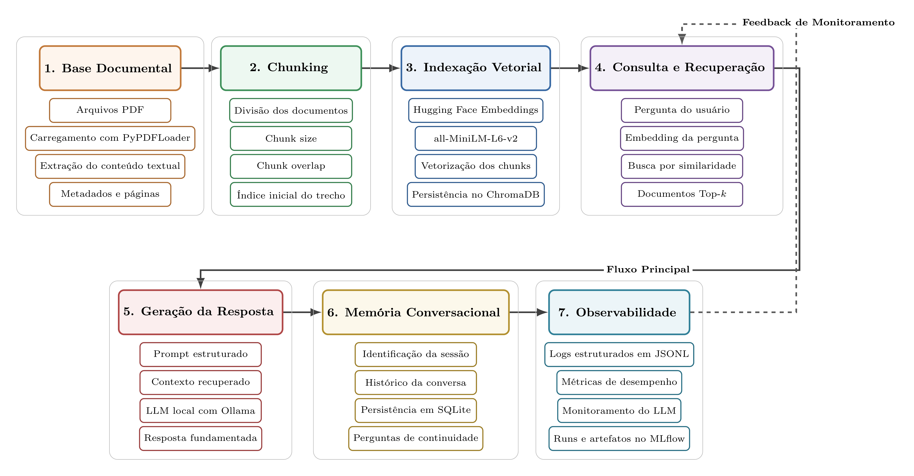
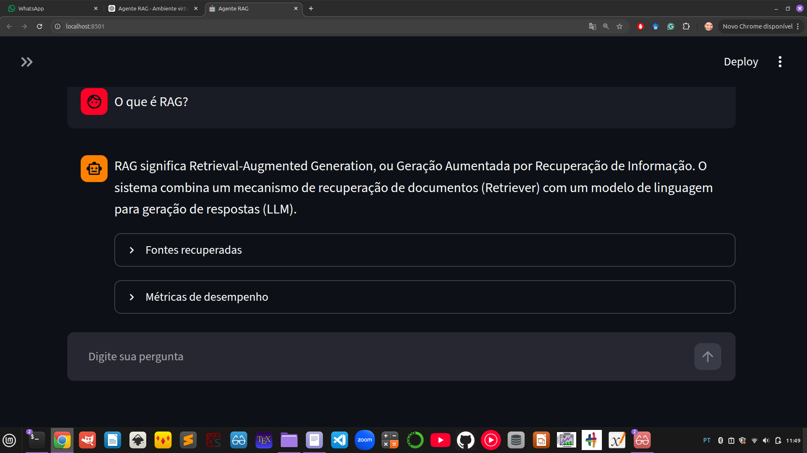
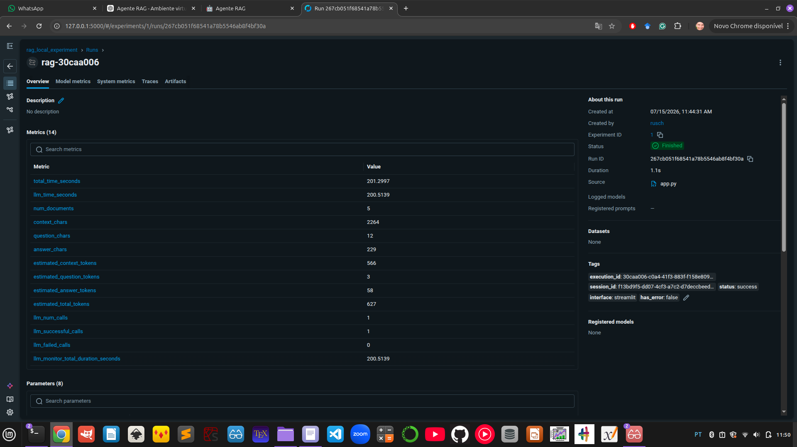

# Agente RAG Local com LangChain, Ollama, ChromaDB, SQLite, MLflow e Streamlit

<p align="center">
  <strong>
    Aplicação completa de Retrieval-Augmented Generation executada localmente,
    com memória conversacional, observabilidade estruturada e monitoramento de experimentos.
  </strong>
</p>

<p align="center">
  
</p>

---

## Visão geral

Este projeto implementa um agente de Inteligência Artificial baseado em
**Retrieval-Augmented Generation (RAG)**.

O sistema responde perguntas utilizando exclusivamente uma base local de documentos PDF.
Antes de gerar uma resposta, a aplicação pesquisa os trechos mais relevantes da documentação,
constrói um contexto e o envia para um modelo de linguagem executado localmente pelo Ollama.

Além do pipeline tradicional de RAG, o projeto inclui recursos associados a aplicações mais
próximas de produção:

- arquitetura modular;
- banco vetorial persistente;
- modelo de embeddings local;
- LLM local;
- memória conversacional persistente;
- sessões independentes;
- logs estruturados em JSONL;
- métricas de desempenho;
- monitoramento das chamadas ao LLM;
- rastreamento de experimentos com MLflow;
- interface gráfica desenvolvida com Streamlit.

A base de conhecimento principal foi construída para transformar o próprio agente em um
**tutor de conceitos fundamentais de RAG**.

---

## Objetivos do projeto

O projeto foi desenvolvido com os seguintes objetivos:

1. construir um pipeline RAG completo utilizando LangChain;
2. processar documentos PDF e convertê-los em uma base vetorial;
3. utilizar embeddings e modelos de linguagem executados localmente;
4. permitir perguntas dependentes do histórico da conversa;
5. persistir sessões e mensagens em SQLite;
6. implementar observabilidade detalhada;
7. registrar métricas, parâmetros e artefatos no MLflow;
8. desacoplar o backend da interface;
9. disponibilizar uma aplicação interativa com Streamlit;
10. demonstrar práticas de engenharia de software aplicadas a sistemas de IA generativa.

---

## Arquitetura

A aplicação é organizada em sete módulos principais.

### 1. Base documental

Responsável por carregar os arquivos PDF armazenados na pasta `base/`.

Cada página é convertida em um documento LangChain contendo:

- conteúdo textual;
- arquivo de origem;
- número da página;
- metadados associados.

### 2. Chunking

Os documentos são divididos em blocos menores utilizando
`RecursiveCharacterTextSplitter`.

Configuração utilizada:

```python
chunk_size = 1000
chunk_overlap = 200
```

O overlap preserva parte do contexto entre chunks consecutivos e reduz a perda de informação
nas fronteiras dos blocos.

### 3. Indexação vetorial

Cada chunk é transformado em um embedding por meio do modelo:

```text
sentence-transformers/all-MiniLM-L6-v2
```

Os vetores e seus metadados são persistidos no ChromaDB.

### 4. Consulta e recuperação

Quando o usuário faz uma pergunta:

1. a pergunta é convertida em embedding;
2. o Retriever consulta o ChromaDB;
3. ocorre uma busca por similaridade semântica;
4. os documentos Top-k são recuperados;
5. os documentos formam o contexto da resposta.

### 5. Geração da resposta

Os documentos recuperados são inseridos em um prompt estruturado.

O modelo de linguagem é executado localmente com Ollama e recebe:

- instruções do sistema;
- histórico da conversa;
- documentos recuperados;
- pergunta do usuário.

O prompt orienta o modelo a responder apenas com base no contexto documental.

### 6. Memória conversacional

O histórico é persistido em SQLite.

Cada interação é associada a um `session_id`, permitindo:

- perguntas de continuidade;
- múltiplas conversas;
- recuperação de sessões anteriores;
- persistência entre reinicializações da aplicação.

### 7. Observabilidade

Cada execução produz:

- logs estruturados em JSONL;
- métricas de desempenho;
- metadados da sessão;
- dados dos documentos recuperados;
- informações das chamadas ao LLM;
- uma Run no MLflow.

A seta tracejada no diagrama representa o ciclo de monitoramento utilizado para analisar e
aperfeiçoar a recuperação e a geração das respostas.

---

## Fluxo completo de execução

```text
Arquivos PDF
      │
      ▼
Carregamento dos documentos
      │
      ▼
Divisão em chunks
      │
      ▼
Geração dos embeddings
      │
      ▼
Persistência no ChromaDB
      │
      ▼
Pergunta do usuário
      │
      ▼
Recuperação do histórico da sessão
      │
      ▼
Reescrita contextual da pergunta
      │
      ▼
Embedding da pergunta
      │
      ▼
Busca por similaridade
      │
      ▼
Recuperação dos documentos Top-k
      │
      ▼
Construção do prompt
      │
      ▼
Inferência com Ollama
      │
      ▼
Resposta final
      │
      ├──► SQLite
      ├──► Logs JSONL
      ├──► PerformanceMetrics
      ├──► LLMMonitor
      └──► MLflow
```

---

## Tecnologias utilizadas

| Tecnologia | Responsabilidade |
|---|---|
| Python | Linguagem principal |
| LangChain | Orquestração do pipeline RAG |
| Ollama | Execução local do modelo de linguagem |
| Hugging Face | Modelo local de embeddings |
| Sentence Transformers | Representação semântica dos textos |
| ChromaDB | Banco de dados vetorial |
| SQLite | Persistência da memória conversacional |
| Streamlit | Interface gráfica |
| MLflow | Registro de experimentos, métricas e artefatos |
| JSONL | Logs estruturados |
| PyPDFLoader | Extração de conteúdo dos PDFs |

---

## Estrutura do projeto

```text
RAG/
│
├── app.py
├── criar_db.py
├── perguntar_v4.py
├── requirements.txt
├── README.md
│
├── base/
│   └── Fundamentos de Retrieval-Augmented Generation.pdf
│
├── db/
│   └── Banco vetorial persistido pelo ChromaDB
│
├── data/
│   ├── rag_memory.db
│   └── mlflow.db
│
├── logs/
│   └── rag_app.jsonl
│
├── docs/
│   ├── arquitetura_rag.png
│   ├── streamlit_interface.png
│   └── mlflow_dashboard.png
│
└── src/
    │
    ├── application/
    │   ├── __init__.py
    │   └── rag_application.py
    │
    ├── core/
    │   ├── __init__.py
    │   ├── embeddings.py
    │   ├── vectorstore.py
    │   ├── retriever.py
    │   ├── llm.py
    │   ├── prompts.py
    │   └── chains.py
    │
    ├── memory/
    │   ├── __init__.py
    │   ├── database.py
    │   ├── conversation_repository.py
    │   └── conversation_memory.py
    │
    ├── observability/
    │   ├── __init__.py
    │   ├── logger_manager.py
    │   ├── metrics.py
    │   ├── execution_context.py
    │   ├── llm_monitor.py
    │   └── mlflow_manager.py
    │
    └── config.py
```

---

## RAGApplication

A classe `RAGApplication` constitui o backend central da aplicação.

Ela concentra a orquestração de:

- banco vetorial;
- Retriever;
- LLM;
- prompts;
- Retrieval Chain;
- memória conversacional;
- observabilidade;
- persistência;
- MLflow.

A interface de terminal e a interface Streamlit utilizam o mesmo backend:

```python
app = RAGApplication()

resultado = app.ask(
    question=pergunta,
    session_id=session_id,
)
```

Essa separação permite reutilizar o núcleo do projeto em outras interfaces, como:

- FastAPI;
- aplicação desktop;
- bot corporativo;
- microsserviço;
- integração com Slack ou Microsoft Teams.

---

## Criação do banco vetorial

O arquivo `criar_db.py` executa todo o processo de indexação:

```text
PDF
 → documentos
 → chunks
 → embeddings
 → ChromaDB
```

O script carrega todos os PDFs existentes na pasta `base/`.

```python
PyPDFDirectoryLoader(
    str(PASTA_BASE),
    glob="*.pdf",
)
```

Antes da nova indexação, o banco anterior é removido:

```python
if PASTA_DB.exists():
    shutil.rmtree(PASTA_DB)
```

Assim, o banco vetorial sempre representa o conteúdo atual da pasta `base/`.

### Recriando o banco

Sempre que um PDF for:

- adicionado;
- removido;
- substituído;
- modificado,

execute:

```bash
python criar_db.py
```

Não é necessário recriar o banco ao alterar apenas o valor de `k` do Retriever.

---

## Embeddings

O projeto utiliza o modelo:

```text
sentence-transformers/all-MiniLM-L6-v2
```

Esse modelo apresenta um bom equilíbrio entre:

- velocidade;
- uso de memória;
- qualidade semântica;
- facilidade de execução local.

Os embeddings permitem que o sistema encontre trechos semanticamente relacionados, mesmo
quando a pergunta não utiliza exatamente as mesmas palavras presentes no documento.

---

## ChromaDB

O ChromaDB armazena:

- embeddings;
- conteúdo dos chunks;
- arquivo de origem;
- número da página;
- índice inicial do trecho;
- demais metadados.

Durante uma consulta, a pergunta é transformada em embedding e comparada com os vetores
persistidos.

O banco retorna os documentos com maior similaridade semântica.

---

## Retriever

O Retriever define quantos documentos são recuperados em cada consulta.

Exemplo:

```python
retriever = db.as_retriever(
    search_type="similarity",
    search_kwargs={
        "k": 5,
    },
)
```

O parâmetro `k` controla a quantidade de chunks enviados ao modelo.

Valores pequenos podem omitir informações relevantes.

Valores excessivamente grandes podem:

- aumentar a latência;
- inserir conteúdo irrelevante;
- aumentar o contexto;
- prejudicar a objetividade da resposta.

---

## Memória conversacional

A memória persistente utiliza SQLite e segue uma organização baseada no padrão Repository:

```text
SQLiteConnection
        │
        ▼
ConversationRepository
        │
        ▼
ConversationMemory
```

Cada interação armazena:

- `execution_id`;
- `session_id`;
- pergunta;
- resposta;
- modelo;
- temperatura;
- status;
- métricas;
- documentos recuperados;
- metadados;
- timestamps.

O histórico é convertido em mensagens LangChain:

```python
HumanMessage(...)
AIMessage(...)
```

Isso permite perguntas como:

```text
Usuário:
Quanto custa o curso?

Assistente:
O curso custa...

Usuário:
E por quanto tempo tenho acesso?
```

A segunda pergunta pode ser contextualizada utilizando a primeira interação.

---

## Observabilidade

A camada de observabilidade foi desenvolvida em módulos independentes.

### LoggerManager

Registra eventos estruturados em formato JSONL.

Cada linha do arquivo representa uma execução ou erro.

Exemplo simplificado:

```json
{
  "event_type": "rag_execution",
  "execution_id": "004f982d-...",
  "session_id": "c6af8c1e-...",
  "status": "success",
  "question": "O que é um sistema RAG?",
  "answer": "Um sistema RAG combina...",
  "metrics": {
    "total_time_seconds": 249.2482,
    "llm_time_seconds": 245.9001,
    "num_documents": 3
  }
}
```

### PerformanceMetrics

Coleta métricas como:

- tempo total;
- tempo do Retriever;
- tempo do LLM;
- número de documentos;
- caracteres do contexto;
- caracteres da pergunta;
- caracteres da resposta;
- tokens estimados.

### ExecutionContext

Representa uma execução completa.

Centraliza:

- pergunta;
- resposta;
- documentos;
- métricas;
- modelo;
- temperatura;
- status;
- erros;
- sessão;
- timestamps;
- metadados.

### LLMMonitor

Utiliza callbacks do LangChain para monitorar:

- chamadas ao LLM;
- mensagens enviadas;
- resposta bruta;
- duração;
- tokens;
- erros;
- parâmetros do modelo.

---

## MLflow

Cada pergunta gera uma Run no experimento:

```text
rag_local_experiment
```

### Parâmetros registrados

- modelo do LLM;
- modelo de embeddings;
- temperatura;
- tipo da aplicação;
- banco vetorial;
- provedor do LLM;
- tamanho do histórico;
- captura do prompt.

### Métricas registradas

- tempo total;
- tempo do LLM;
- número de documentos;
- tamanho do contexto;
- tokens estimados;
- número de chamadas ao LLM;
- chamadas bem-sucedidas;
- chamadas com erro.

### Tags registradas

- `execution_id`;
- `session_id`;
- `status`;
- `interface`;
- presença de erro.

### Artefatos registrados

```text
input/
└── question.txt

output/
└── answer.txt

execution/
└── execution_context.json

retrieval/
└── retrieved_documents.json

errors/
└── error.txt
```

---

## Interface Streamlit

A interface gráfica oferece:

- chat no estilo assistente virtual;
- criação de novas conversas;
- sessão independente;
- histórico persistente;
- exibição das fontes;
- visualização das métricas;
- contador de interações;
- integração direta com o backend `RAGApplication`.

Para iniciar:

```bash
streamlit run app.py
```

A aplicação será disponibilizada normalmente em:

```text
http://localhost:8501
```

---

## Instalação

### 1. Clone o repositório

```bash
git clone URL_DO_REPOSITORIO
cd NOME_DO_REPOSITORIO
```

### 2. Crie o ambiente Conda

```bash
conda create -n rag python=3.12 -y
conda activate rag
```

### 3. Instale as dependências

```bash
pip install -r requirements.txt
```

### 4. Instale o Ollama

Consulte as instruções oficiais para seu sistema operacional.

Depois baixe o modelo utilizado pelo projeto:

```bash
ollama pull qwen2.5:3b
```

Confirme que o Ollama está funcionando:

```bash
ollama list
```

---

## Configuração

As principais configurações estão centralizadas em:

```text
src/config.py
```

Exemplo:

```python
MODELO_EMBEDDINGS = (
    "sentence-transformers/all-MiniLM-L6-v2"
)

MODELO_LLM = "qwen2.5:3b"

TEMPERATURA_LLM = 0.0

LIMITE_HISTORICO = 6

CAPTURAR_PROMPT = True

CHUNK_SIZE = 1000

CHUNK_OVERLAP = 200

TOP_K = 5
```

---

## Como executar

### 1. Adicione os PDFs

Coloque os documentos em:

```text
base/
```

### 2. Crie o banco vetorial

```bash
python criar_db.py
```

### 3. Execute pelo terminal

```bash
python perguntar_v4.py
```

### 4. Execute com Streamlit

```bash
streamlit run app.py
```

---

## Executando o MLflow

O projeto utiliza SQLite como backend do MLflow.

Inicie o servidor na raiz do projeto:

```bash
mlflow server \
  --backend-store-uri sqlite:///data/mlflow.db \
  --default-artifact-root ./mlartifacts \
  --port 5000
```

Acesse:

```text
http://127.0.0.1:5000
```

No menu do MLflow, selecione:

```text
Model training
→ Experiments
→ rag_local_experiment
→ Runs
```

---

## Exemplos de perguntas

### Pergunta conceitual

```text
O que é um sistema RAG?
```

### Pergunta por similaridade semântica

```text
Como os vetores dos documentos são organizados
para permitir buscas por significado?
```

### Pergunta que combina diferentes trechos

```text
Explique como o chunking influencia a qualidade
dos embeddings e o desempenho do banco vetorial.
```

### Pergunta sobre o pipeline

```text
Descreva o caminho percorrido por uma pergunta
até a geração da resposta pelo LLM.
```

### Pergunta fora do escopo

```text
Quem foi Albert Einstein?
```

Com o prompt atual, o comportamento esperado é:

```text
Não encontrei essa informação na base de documentos.
```

---

## Estratégia de validação

O sistema pode ser avaliado utilizando quatro tipos de perguntas.

| Tipo | Objetivo |
|---|---|
| Literal | Verificar recuperação de informação explícita |
| Semântica | Testar sinônimos e reformulações |
| Composição | Verificar combinação de múltiplos chunks |
| Fora do escopo | Avaliar controle de alucinações |

Também podem ser comparadas configurações como:

- `k = 3`, `k = 5` e `k = 8`;
- diferentes tamanhos de chunk;
- diferentes overlaps;
- diferentes modelos de embeddings;
- diferentes modelos Ollama;
- diferentes prompts.

As métricas podem ser acompanhadas pelo MLflow.

---

## Resultados observados

Durante os testes, o sistema demonstrou capacidade de:

- responder perguntas diretamente presentes na documentação;
- sintetizar informações de múltiplos chunks;
- utilizar memória para perguntas de continuidade;
- recusar perguntas fora do escopo;
- registrar métricas e artefatos;
- recuperar documentos com indicação da fonte;
- persistir o histórico das conversas.

Algumas perguntas semanticamente ambíguas ainda podem recuperar chunks incorretos.

Esse comportamento evidencia a importância de:

- ajustar o Top-k;
- revisar o chunking;
- analisar os documentos recuperados;
- implementar reranking;
- avaliar diferentes modelos de embeddings.

---

## Limitações

A versão atual apresenta algumas limitações:

- o banco vetorial é recriado integralmente;
- não há indexação incremental;
- não há autenticação;
- o modelo local pode apresentar latência elevada;
- a estimativa de tokens é aproximada;
- a qualidade depende diretamente da base documental;
- não foi implementado reranking;
- não há busca híbrida;
- não há avaliação automatizada das respostas;
- o projeto foi desenvolvido prioritariamente para execução local.

---

## Próximas evoluções

- [ ] MLflow Tracing para LangChain;
- [ ] painel de depuração do Retriever;
- [ ] score de similaridade por documento;
- [ ] reranking dos chunks;
- [ ] busca híbrida semântica e lexical;
- [ ] indexação incremental por hash;
- [ ] suporte a DOCX, Markdown e HTML;
- [ ] testes automatizados com Pytest;
- [ ] API REST com FastAPI;
- [ ] Docker e Docker Compose;
- [ ] avaliação automática da qualidade das respostas;
- [ ] autenticação e isolamento por usuário;
- [ ] deploy em nuvem.

---

## Decisões arquiteturais

### Por que utilizar um modelo local?

- privacidade;
- ausência de custos por requisição;
- controle do ambiente;
- execução offline;
- possibilidade de trabalhar com documentos confidenciais.

### Por que utilizar ChromaDB?

- integração direta com LangChain;
- persistência local;
- facilidade de uso;
- suporte a metadados;
- adequado para protótipos e aplicações locais.

### Por que utilizar SQLite?

- banco leve;
- ausência de servidor externo;
- persistência simples;
- excelente integração com Python;
- suficiente para a memória conversacional desta versão.

### Por que criar a `RAGApplication`?

A classe desacopla o backend das interfaces.

Isso permite que terminal, Streamlit ou futuras APIs utilizem exatamente o mesmo núcleo.

### Por que utilizar MLflow?

- rastreamento de experimentos;
- comparação de configurações;
- registro de métricas;
- armazenamento de artefatos;
- histórico de execuções;
- apoio à observabilidade e evolução do sistema.

---

## Documentação técnica

A base de conhecimento do agente foi produzida especificamente para este projeto:

```text
Fundamentos de Retrieval-Augmented Generation (RAG)
```

O documento aborda:

- fundamentos de RAG;
- base de conhecimento;
- chunking;
- embeddings;
- banco vetorial;
- Retriever;
- prompts;
- modelos de linguagem;
- arquitetura da aplicação;
- observabilidade;
- memória;
- MLflow.

Após ser indexado, o próprio agente passa a funcionar como um tutor sobre sua arquitetura e
sobre os conceitos utilizados em sua implementação.

---

## Screenshots

### Interface Streamlit

<p align="center">
  
</p>

### MLflow

<p align="center">
  
</p>

### Arquitetura

<p align="center">
  
</p>

---

## Aprendizados

O desenvolvimento deste projeto permitiu consolidar conhecimentos relacionados a:

- Retrieval-Augmented Generation;
- processamento de documentos;
- embeddings;
- bancos vetoriais;
- similaridade semântica;
- LangChain;
- modelos locais com Ollama;
- arquitetura modular;
- persistência com SQLite;
- observabilidade;
- callbacks;
- MLflow;
- desenvolvimento de interfaces com Streamlit;
- documentação técnica;
- engenharia de software aplicada à IA generativa.

---

## Autor

**Flavio R. Rusch**

Doutor em Física, pesquisador e profissional em transição para Ciência de Dados e
Inteligência Artificial.

- GitHub: [ruschh](https://github.com/ruschh)
- LinkedIn: [flavio-rusch-phd](https://www.linkedin.com/in/flavio-rusch-phd/)
- E-mail: flrrusch@gmail.com

---

## Licença

Este projeto está disponível sob a licença MIT.

Consulte o arquivo:

```text
LICENSE
```

para mais informações.
